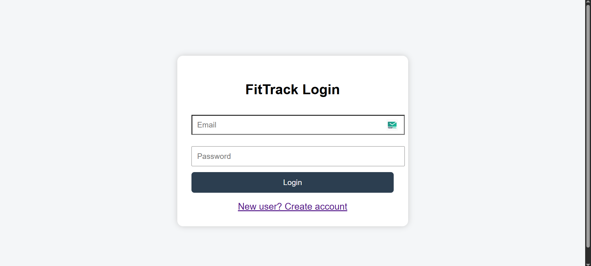
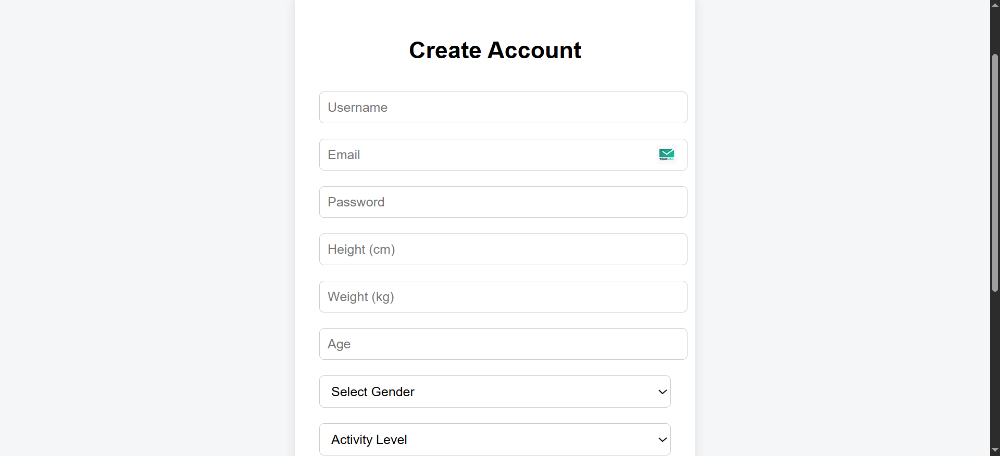
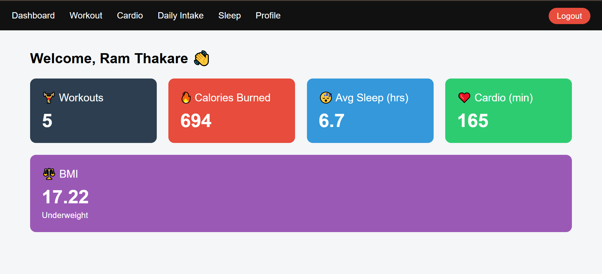
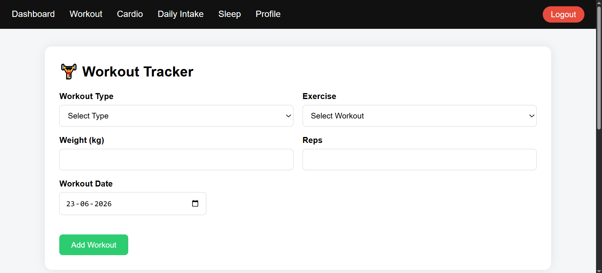
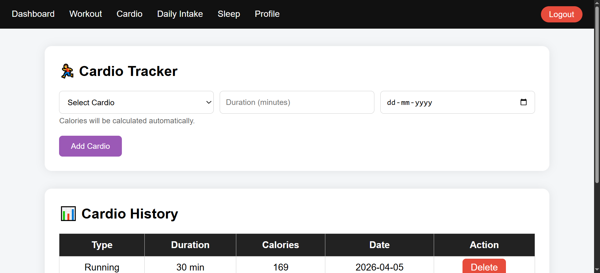
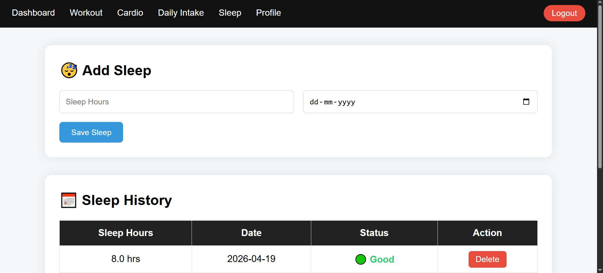
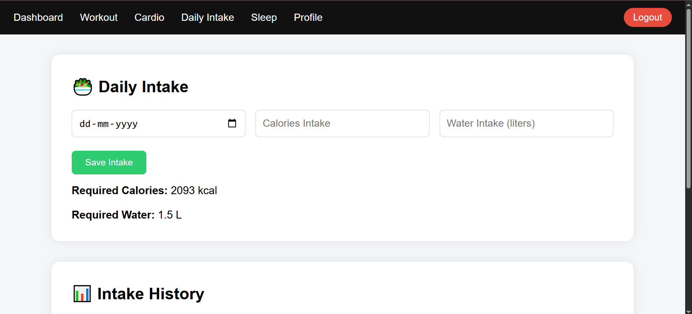
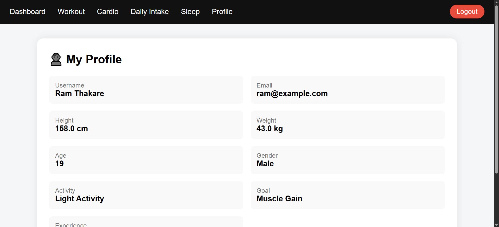

# FitTrack – Fitness Tracking Web Application

## Overview

FitTrack is a Java-based fitness tracking web application developed using JSP, Servlets, JDBC, and MySQL following the MVC Architecture.

The application helps users track workouts, cardio activities, sleep records, and calorie intake while maintaining personal fitness data in a structured manner.

## Features

* User Registration & Login
* Session Management
* Dashboard Overview
* Workout Tracking
* Cardio Activity Tracking
* Sleep Monitoring
* Calorie & Intake Tracking
* Profile Management
* MySQL Database Integration

## Tech Stack

### Backend

* Java
* Servlets
* JDBC

### Frontend

* JSP
* HTML
* CSS
* JavaScript

### Database

* MySQL

### Architecture

* MVC (Model View Controller)

## Project Structure

* Controller Layer (Servlets)
* Model Layer (Java Classes)
* Database Layer (JDBC Connection)
* View Layer (JSP Pages)

## Screenshots

### Login Page

### Registration Page

### Dashboard

### Workout Tracking

### Cardio Tracking

### Sleep Tracking

### Daily Intake Tracking

### Profile Page

## Future Improvements

* Spring Boot Migration
* REST API Integration
* Responsive UI Enhancements
* Fitness Analytics Dashboard

## Author

Ram Thakare
